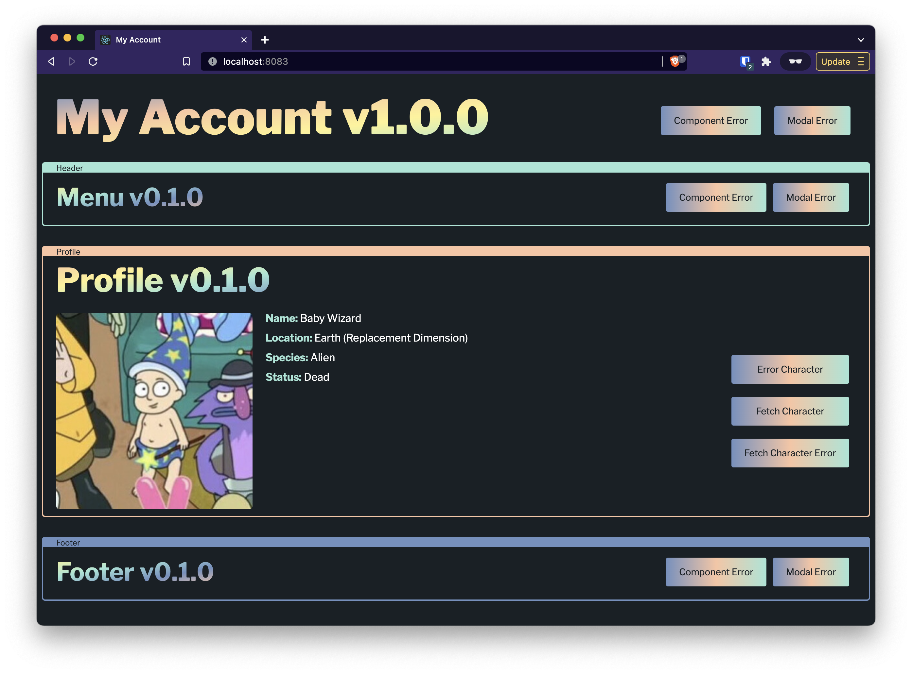

# Micro-Frontend Observability



## 2 projects

- `apps/shell` - a NextJS application, the host of the micro-frontend modules
- `micro-frontends` - the micro-frontend composable applications
- `packages` - shared functionality for shell & micro-frontend applications

## Prerequisites

- [New Relic](https://one.newrelic.com/)
- Terraform (optional)

## Setup

1. Create a New Relic browser application
2. Add your New Relic script at [`apps/shell/public/statis/newrelic.js`](./apps/shell/public/statis/newrelic.js)
3. (Optional) Add Terraform local variables at [`terraform/locals.tf`](./terraform/locals.tf)
4. Run `yarn dev` or `npm run dev`

---

## Example New Relic Queries</summary>

```sql
SELECT * FROM JavaScriptError WHERE appName = '{newRelic-appName}' SINCE 1 week ago
```

```sql
SELECT * FROM JavaScriptError WHERE appName = '{newRelic-appName}' AND errorType = 'ErrorBoundary' SINCE 1 week ago
```

```sql
SELECT * FROM JavaScriptError WHERE appName = '{newRelic-appName}' AND errorType = 'ErrorBoundary' AND componentSource = 'Header' SINCE 1 week ago
```

```sql
SELECT * FROM PageAction WHERE appName = '{newRelic-appName}' AND moduleName = 'mfe-app-module' AND componentSource = 'Header' SINCE 1 week ago
```

```sql
SELECT count(*) FROM PageAction WHERE appName = '{newRelic-appName}' AND moduleName = 'mfe-app-module' AND componentSource = 'Header' SINCE 1 week ago
```